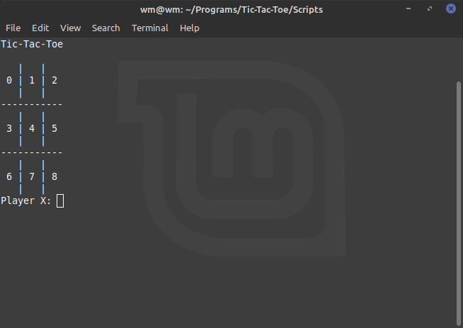
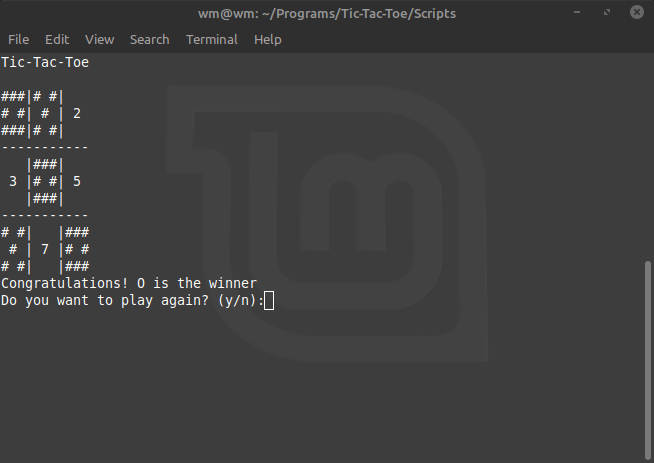

# Tic-Tac-Toe
The game everyone may know, but I would like to remind rules. Who first set three X or O in one line win. It's a simple version 1vs1. In the future I am going to include minmax algorihm and version with AI.

This is my first project that I try to learn c++11 standard and STL library:
* auto type
* unique_ptr / shared_ptr
* vector2D

*START GAME

*FININSH GAME

